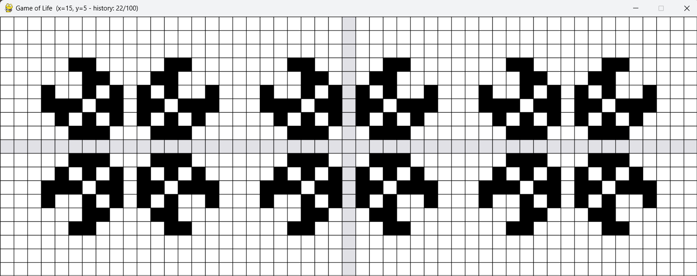
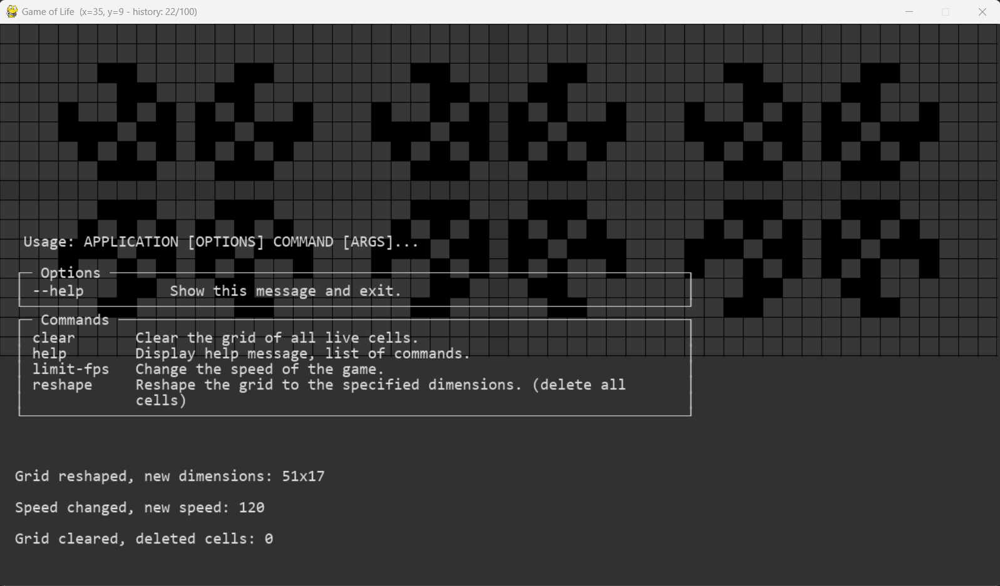

<div align="center">
    <h1 style="font-size: large; font-weight: bold;">Game of Life</h1>
    <a href="#">
        
    </a>
    <a href="#">
        
    </a>
  <br>
</div>

## Presentation

This project is a simple implementation of the Game of Life in Python using Pygame. There no buttons, all the actions are done with the mouse and the keyboard or with the console.



## Installation

This project use poetry, to install the dependencies, you can run the following command:

```bash
poetry install
```

## Usage

To run the project, you can use the following command:

```bash
poetry run python src
```

## Commands

The 'game' is controlled with the mouse and the keyboard. Here are the available commands:

- `Left click`: Toggle individual cell
- `Right click`: Clear the grid of living cells
- `Space`: Generate the next generation
- `R`: Return to last generation


- `Held left` click: Draw cells (keep the last status of first cell clicked)
- `Held Space`: Generate the next generation automatically

## Console

You can also use the console (work with Typer) to interact with the game. To do so, you open console with `²` key and type 'help' to see the available commands.

